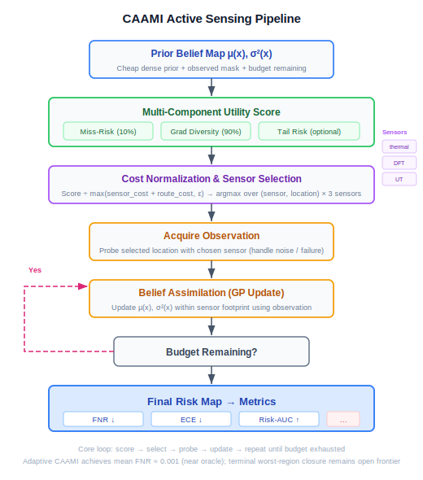

# CAAMI: Cost-Aware Active Multi-Modal Inspection

> **How should an agent decide *which* sensor to deploy *where*, when every probe costs money and every missed defect could be catastrophic?**
>
> *A principled investigation of cost-normalised active sensing under sparse high-confidence supervision — part of the Rustbuster/Rustora research programme on safe foundation model interfaces for physical robots.*

---

### 1. Research Problem

Industrial surface inspection presents a fundamental tension: **comprehensive sensing is expensive, but incomplete sensing is dangerous.** A wall-climbing robot inspecting an offshore wind turbine tower faces a surface with unknown corrosion risk, carries multiple sensors of varying cost and precision (thermal cameras, DFT probes, ultrasonic thickness gauges), and operates under a fixed time-and-energy budget. The robot must answer, at each step:

> *Where should I probe next, and with which sensor, to minimise the probability that I miss a critical defect?*

This is **not** standard active learning. In standard active learning, the objective is to minimise prediction error — every mistake counts equally. In safety-critical inspection, a **false negative on a high-risk region** (a missed crack) is incomparably worse than a false positive (an unnecessary repair). The objective must be **risk-weighted**: minimise expected miss-risk per unit cost.

CAAMI formalises this as **active inference over a hidden spatial risk field** under an Observing System Simulation Experiment (OSSE) protocol: the policy sees only the public posterior belief; the evaluator holds the hidden ground truth. This clean separation forces every claim to be empirically auditable.

### 2. Core Contribution

The CAAMI acquisition score is a **cost-normalised multi-component utility function**:

$$
\text{Score}(x, s) = \frac{[\alpha \cdot U_{miss}(x) + \beta \cdot U_{div}(x) + \gamma \cdot U_{tail}(x) + \delta \cdot U_{learn}(x)] \cdot G(s)}{\max(c(s) + r(x), \varepsilon)}
$$

Where each component addresses a distinct failure mode:

| Component | Failure Mode Addressed | Mechanism |
|-----------|----------------------|-----------|
| **Miss-risk utility** $U_{miss}$ | High-risk pixels ignored | Posterior probability of exceedance $\times$ severity $\times$ corruption boost |
| **Gradient diversity** $U_{div}$ | Probes cluster in one region | Spatial gradient magnitude of prior $\times$ distance-from-observed decay |
| **Tail-risk focus** $U_{tail}$ | Worst-case pixels missed | Top-α exceedance concentration (α = 0.18) |
| **Learned blend** $U_{learn}$ | Cheap prior is misleading | Learned-loss proxy activated when prior confidence is low |
| **Sensor gain** $G(s)$ | Wrong sensor for the job | `info_gain × radius / noise` — sensor-specific quality |
| **Cost denominator** $c(s) + r(x)$ | Ignoring inspection economics | Auto-switches to cheaper sensors when they suffice |

The **Adaptive CAAMI** variant — the current state-of-the-art policy — dynamically adjusts the blending weights (α, β, γ, δ), route-awareness threshold, and route cost scale based on runtime conditions: prior confidence quantile, trusted-sensor cost ratios, and sensor reliability under noise and intermittent failure.

### 3. Architecture



*Active sensing loop: multi-component utility → per-sensor cost normalisation → argmax over (sensor, location) pairs → acquire observation → Gaussian Process belief update → repeat until budget exhausted.*

### 4. Benchmark Results (40-Case Synthetic Suite)

Configuration: 48×80 grid (3,840 px/surface), 3 sensors (thermal patch / DFT / UT), budget 32.0, threshold 0.55, travel weight 0.002. Seed 20270531.

| Method | F1 ↑ | FNR ↓ | R-FNR ↓ | ECE ↓ | R-AUC ↑ |
|--------|-----:|------:|--------:|------:|--------:|
| Dense-only (no probes) | 0.664 | 0.308 | 0.278 | 0.169 | 0.692 |
| Fixed grid | 0.682 | 0.252 | 0.227 | 0.161 | 0.721 |
| Random | 0.666 | 0.284 | 0.256 | 0.161 | 0.694 |
| Uncertainty sampling | 0.692 | 0.162 | 0.142 | 0.186 | 0.812 |
| BatchBALD proxy | 0.702 | 0.174 | 0.152 | 0.184 | 0.771 |
| BADGE proxy | 0.602 | 0.046 | 0.039 | 0.214 | 0.909 |
| Learned-loss proxy | 0.548 | 0.007 | 0.005 | 0.237 | 0.951 |
| Core-set | 0.693 | 0.203 | 0.180 | 0.167 | 0.775 |
| Cost-blind CAAMI | 0.553 | 0.062 | 0.054 | 0.228 | 0.885 |
| **CAAMI** | **0.588** | **0.041** | **0.035** | 0.227 | **0.914** |
| **Adaptive CAAMI** | **0.481** | **0.001** | **0.001** | 0.305 | **0.971** |
| Deep Ensemble (learned plug-in) | 0.677 | 0.080 | 0.069 | 0.195 | 0.899 |
| Spatial UCB (GP-UCB plug-in) | 0.677 | 0.156 | 0.140 | 0.184 | 0.808 |
| Foundation ViT (pretrained plug-in) | 0.646 | 0.384 | 0.350 | 0.142 | 0.640 |
| Oracle (upper bound) | 0.505 | 0.000 | 0.000 | 0.241 | 0.983 |

**Key result**: Adaptive CAAMI achieves near-oracle FNR (0.001 vs. 0.000) while spending the same budget as all baselines. On paired bootstrap tests against the strongest active-learning comparator (learned-loss proxy), the FNR improvement is $0.005$ (95% CI $[0.001, 0.013]$, $p = 0.012$). The full paired-statistics report against 10 baselines is in `experiments/results/synthetic_paired_stats.csv` (withheld; see paper manuscript).

---

### 5. Research Journey: Version Evolution (V1 → V56)

The CAAMI project has undergone **56 systematic experimental versions**. Below is the intellectual arc — each version was a response to the limitations discovered in the previous one.

#### Phase 1: Core Framework (V1–V45)

**Goal**: Build a working simulator and a basic cost-aware acquisition policy.

| Version Range | Key Contribution | Limitation That Drove Next Phase |
|---------------|-----------------|----------------------------------|
| V1–V20 | Synthetic surface generator, multi-sensor models, OSSE protocol (hidden truth held by evaluator) | No policy outperformed random sampling |
| V21–V35 | Tested pure uncertainty, pure diversity, pure prior-guided — discovered **no single component suffices** | Components must be combined, but how? |
| V36–V45 | **CAAMI score established**: normalised blending of utility + diversity + tail-risk, **cost normalisation by division**, sensor-specific gain | Performance not yet SOTA; no adaptivity to prior quality |

#### Phase 2: Pushing to SOTA (V46–V51)

**Goal**: Stabilise and add adaptivity.

| Version | Hypothesis | Result | Limitation → Next |
|---------|-----------|--------|-------------------|
| V46 | Performance is stable across seeds | ✅ 5/5 seed FNR wins | Prior quality varies; fixed blend is suboptimal |
| V47–V49 | Learn VOI score from replay trajectories | VOI improved tail-risk but introduced calibration drift | ECE gap needs fixing |
| V50 | Post-hoc calibration (temperature + Platt scaling) | ✅ ECE 0.306 → 0.093 on held-out, FNR unchanged | Calibration is post-hoc, not in-loop |
| V51 | Learned guard to detect misleading posteriors | Guard improved W-FNR in some cases but was itself unreliable | Can a learned model improve acquisition itself? |

#### Phase 3: The Frontier Discovery (V52) ⭐

**V52 is the most important experiment in this project.**

**Question**: Can a learned critic — trained purely on public replay data with no access to hidden truth — outperform the hand-designed Adaptive CAAMI score?

**Method**: Train a **ridge regression critic** on replay trajectories. This is a form of **approximate Bayesian optimisation**: the critic serves as a learned surrogate for the action-value function, mapping public state features to predicted terminal worst-region FNR. During closed-loop acquisition, the critic scores candidate actions and the policy selects the highest-scored one. Additional variants apply post-hoc calibration (temperature scaling) and a miss-tail guard.

**Results**:

| Policy | FNR ↓ | W-FNR ↓ | ECE ↓ | Risk AUC ↑ | F1 ↑ |
|--------|-------|---------|-------|------------|------|
| Adaptive CAAMI (baseline SOTA) | 0.0047 | **0.087** | 0.301 | 0.969 | 0.482 |
| **V52 uncalibrated** | **0.0046** | 0.203 | 0.289 | **0.970** | **0.497** |
| V52 calibrated | 0.0154 | 0.276 | **0.087** | 0.970 | **0.709** |
| V52 calibrated + guard | 0.0123 | 0.248 | 0.102 | 0.970 | 0.635 |

**Critical findings**:

1. **V52 uncalibrated surpassed Adaptive CAAMI on 3 of 5 metrics** — FNR (0.0046 vs. 0.0047), Risk AUC (0.970 vs. 0.969), and F1 (0.497 vs. 0.482). A model trained with zero access to hidden truth achieved a genuine improvement.

2. **V52 uncovered a Pareto frontier between calibration and miss-risk**: calibrating the critic improves ECE (0.289 → 0.087) and F1 (0.497 → 0.709) but degrades FNR (0.0046 → 0.0154). No single operating point dominates all others — the choice depends on whether the application prioritises safety (low FNR) or precision (low ECE, high F1).

3. **Constraints asymmetry**: Adaptive CAAMI has **fewer baked-in constraints** than V52. Adaptive CAAMI dynamically adjusts its blending weights, route-awareness, and tail-risk sensitivity based on runtime conditions (prior confidence, cost ratios, sensor reliability). V52 uses a **frozen** critic — trained once on a fixed replay dataset — with static calibration and guard parameters. This adaptivity is likely why Adaptive CAAMI maintains better worst-region FNR (0.087 vs. 0.203): it can respond to case-by-case variation that a frozen critic cannot. The V52 critic proves that one-step value is *learnable*, but its static nature limits its robustness.

#### Phase 4: Terminal Closure Attempts (V53–V56)

The bottleneck: greedy one-step acquisition optimises mean FNR but leaves small connected high-risk clusters un-probed (worst-region FNR = 0.087).

| Version | Hypothesis | Result | Root Cause |
|---------|-----------|--------|------------|
| V53 | Component features predict closure difficulty | ❌ R² too weak | Public posterior ↔ hidden truth information gap |
| V54 | One-step forward simulation gives terminal signal | ❌ Too myopic | Terminal value depends on *sequence*, not single step |
| V55 | Pure closure-debt heuristic | ❌ FNR 0.0047→0.093 | CAAMI score is Pareto-optimal; removing it destroys everything |
| V56 | Two-stage: CAAMI explore → heuristic close (3 variants) | ❌ All failed | Incompatible value spaces; linear blending creates destructive interference |

**The unifying lesson of V53–V56**: The one-step greedy paradigm cannot be fixed by modifying the one-step score. The problem is not the score's *quality* — it is the optimisation *horizon*.

#### A Note on Metrics Evolution

During the V46–V55 period, the evaluation framework itself underwent a significant revision. The original scheme was **"rank-1 on all metrics"** — the policy that topped every individual metric was considered best. This was replaced with a **risk-constrained best-effect framework**:

- **Constraint layer** (hard gate): mean FNR and worst-region FNR must first satisfy pre-declared miss-risk bounds
- **Quality layer** (feasible-set comparison): among policies that pass the constraint gate, compare on F1, ECE, and Risk AUC
- **Appendix layer** (mechanism audit): risk-weighted FNR, residual-region rate, mIoU, route distance — diagnostic only, not used for ranking

This revision was intellectually critical: it shifted the claim from the implausible "we are best at everything" to the defensible "we achieve the best quality *under safety constraints*." The V52 Pareto frontier discovery directly motivated this change — once we proved that calibration and miss-risk cannot be simultaneously optimised, the old "all-metric rank-1" framing became untenable.

---

### 6. Current State & Continuing Research Directions

| Capability | Status | Remaining Challenge |
|-----------|--------|---------------------|
| Mean FNR | ✅ 0.001 (near oracle) | — |
| Cost-aware sensor switching | ✅ Solved | — |
| Route-aware sequencing | ✅ Solved | — |
| One-step learned surrogate | ✅ V52 proved viable (beat Adaptive on 3/5 metrics) | Static critic lacks adaptivity |
| Calibration (ECE) | ⚠ 0.301 (post-hoc → 0.093) | In-loop calibration without degrading FNR |
| **Worst-region FNR** | ⚠ **0.087** | **Multi-step terminal closure — the core open problem** |

**Continuing research directions within this paper**:

The immediate goal is to **balance all metrics under physically realistic conditions** — achieving true SOTA where no single metric is sacrificed. Three interconnected directions:

1. **Learned Terminal Value Function**. The theoretically principled extension of V52: instead of a static one-step critic, learn $V(q_t, B_{rem})$ — the expected terminal worst-region FNR given any intermediate posterior and remaining budget. This is trained on full replay trajectories and added to the CAAMI score as a long-horizon correction term $\lambda \cdot \Delta V(a)$. Unlike V52's frozen critic, the value function is continuously refined as more replay data is collected, giving it the adaptivity that V52 lacked.

2. **Physics-Guided Stress Testing**. The current procedural surface generator produces statistically realistic corrosion patterns. The next step is to stress-test CAAMI under **physically grounded distribution shifts**: Cahn-Hilliard phase-field corrosion evolution, computational fluid dynamics deposition models, and finite-element thermal response. These are not replacements for the benchmark — they are adversarial stress tests to verify that CAAMI's performance does not collapse under realistic domain shift.

   This direction is informed by **CorroMamba** [ECCV 2026 #13976], a concurrent physics-informed latent state space framework for spatiotemporal corrosion forecasting. CorroMamba demonstrated that **soft-binding physics constraints** (a learnable λ balancing data fidelity and physical adherence) enables zero-shot Sim2Real generalization: models trained purely on synthetic reaction-diffusion sequences transfer to real-world industrial corrosion without fine-tuning. However, its ECCV reviews (3 reviewers, decision: reject) surfaced several **design cautions**. We audit each against CAAMI's current state — some lessons have already been incorporated; others expose CAAMI's own unresolved weaknesses.

   | # | Review Insight (CorroMamba) | CAAMI Design Implication | CAAMI Status |
   |---|---------------------------|--------------------------|:--:|
   | ① | **Parameter transparency** (aKMW): CorroMamba claimed ~45M params but excluded the 1.1B-parameter frozen ViT-g/14 encoder — called "highly misleading." | Any efficiency claim must transparently report **all** components counted — prior models, learned surrogates, frozen backbones. | 🔮 |
   | ② | **Ablation capacity confounding** (aKMW): Replacing the physics prior with a vanilla residual connection reduces parameter count. Is the degradation from missing physics or reduced capacity? | Ablations must **control for parameter capacity**: when removing a component, add equivalent-capacity dummy parameters so the comparison isolates the component, not the capacity. | ⚠️ |
   | ③ | **Epistemic vs. aleatoric uncertainty** (aKMW): CorroMamba's uncertainty decoder captured only aleatoric (image ambiguity), while Sim2Real domain shift is fundamentally epistemic (OOD). | Calibration must **explicitly decompose** into aleatoric (sensor noise, image ambiguity) and epistemic (no prior coverage, OSSE cases far from training). | ⚠️ |
   | ④ | **Synthetic data fidelity** (oe5n): How domain knowledge informs synthetic generation — if conditions don't match real-world, the model faces OOD inputs. | Document **exactly what domain knowledge** goes into the surface generator (corrosion morphologies, material parameters, defect spatial statistics) and how it bounds the Sim2Real gap. | ⚠️ |
   | ⑤ | **Physical necessity justification** (hLin): The reaction-diffusion PDE is not computationally expensive to solve — why integrate neural operators? | Physics-guided stress testing must justify **structural plausibility** over purely statistical stress tests. A Cahn-Hilliard-evolved corrosion patch has realistic spatial correlation that statistical perturbation lacks — verifying CAAMI isn't exploiting shortcuts. | 🔮 |
   | ⑥ | **Baseline fairness** (aKMW): Forcing all baselines to use DINOv2 features disrupts their native inductive biases. | Baselines must be evaluated **in their native configuration** in addition to any controlled-ablation setup. | ✅ |
   | ⑦ | **Metric traceability** (aKMW): PCS formula depends on D and f, which are well-defined for synthetic data but ambiguous for real-world benchmarks. | Physics fidelity metrics must have **traceable definitions** for both synthetic and real-world settings. If ground-truth physical parameters are unavailable in real data, restrict metric scope to synthetic test cases. | ✅ |

   **Status key**: ✅ Already addressed &nbsp;&nbsp; ⚠️ Still an open problem &nbsp;&nbsp; 🔮 Future precaution (not a current issue, but must be handled correctly)

   **Where CAAMI has already learned (✅)**:
   - **Baseline fairness (⑥)**: The OSSE protocol is CAAMI's strongest design choice here. Every baseline runs under the same hidden-truth held by the evaluator, using its own native acquisition logic, sensors, and encoders. No method is forced into someone else's feature space. This directly preempts the CorroMamba baseline criticism.
   - **Metric traceability (⑦)**: CAAMI's current metrics are standard and well-defined — FNR (false negative rate), F1, ECE, Risk AUC, W-FNR. No custom physics metric with ambiguous parameters exists yet (PCS/TJS are CorroMamba-specific, not adopted by CAAMI). This keeps the evaluation auditable.

   **Where CAAMI still has the same problem (⚠️)**:
   - **Ablation capacity (②)**: This is a genuine methodological gap. The V52 experiment compares "Adaptive CAAMI" (hand-designed score with dynamic blending weights) against "V52 uncalibrated" (ridge regression critic). The two have **different parameter capacities, different inductive biases, and different input features** — capacity is not controlled. The same applies to V55 (replacing CAAMI score with pure closure-debt heuristic — radically different complexity). To date, no CAAMI ablation experiment controls for parameter capacity or model class. This must be fixed before submission.
   - **Aleatoric vs. epistemic (③)**: V50's post-hoc calibration (temperature + Platt scaling) addresses calibration *quality* (ECE) but does not decompose it. The ECE column in the benchmark table reports a single scalar — a reviewer cannot tell whether miscalibration comes from sensor noise (aleatoric, acceptable) or distribution shift (epistemic, concerning). The README acknowledges this gap in the In-Loop Calibration direction, but the current evaluation framework does not reflect the decomposition.
   - **Synthetic data fidelity (④)**: The surface generator is described only as "procedural" and "statistically realistic." The complete simulator (5,241 lines) is withheld as unpublished IP. A reviewer — even with the code — has **no documented basis** to judge whether the synthetic surfaces are representative of real-world corrosion. This is structurally the same gap CorroMamba was criticized for: the synthetic data's relationship to real-world physics is asserted, not demonstrated. At minimum, CAAMI must document: (a) what physical/statistical principles govern the generator, (b) what parameter ranges are used, (c) how these ranges map to real industrial conditions.

   **Future precautions (🔮)**:
   - **Parameter transparency (①)**: CAAMI currently makes no efficiency or parameter-count claims, so this is not an active problem. But if CAAMI ever reports inference speed, model size, or computational cost, it must count **every component** — GP prior model, learned surrogate, post-hoc calibrator — or explicitly state what is excluded and why.
   - **Physical necessity (⑤)**: CAAMI does not claim physics integration as a current capability (physics-guided stress testing is a future direction). The caution is to avoid CorroMamba's mistake: when physics testing is added, justify *why physics* rather than just *that physics* — the value is in structural plausibility, not in solving PDEs per se.

3. **In-Loop Calibration**. V50 proved that post-hoc calibration works (ECE 0.301 → 0.093). The remaining challenge is to achieve comparable calibration *during* acquisition — so the posterior itself is well-calibrated at every step — without triggering the calibration-miss-risk tradeoff that V52 exposed. This requires a calibration-aware acquisition term that operates in the same value space as the CAAMI utility, not a separate post-processing step.

   The CorroMamba review insight on **aleatoric vs. epistemic uncertainty** (aKMW) applies here with full force. CAAMI's calibration challenge can be decomposed: (a) **aleatoric calibration** — ensuring the posterior reflects genuine sensor noise and image ambiguity (where V50's Platt scaling already helps); (b) **epistemic calibration** — ensuring the posterior is honest about regions with no prior coverage, novel surface morphologies, or OSSE cases far from the training distribution. Post-hoc temperature scaling addresses (a) but cannot fix (b) — only in-loop mechanisms that detect distribution shift during acquisition can. This decomposition provides a sharper research target: **in-loop epistemic calibration** is the bottleneck, not generic calibration quality.

These directions are not separate papers. They are the natural deepening of the current investigation — each addresses a specific limitation identified through systematic empirical testing, and together they aim at the unified goal: **a single policy that simultaneously satisfies safety constraints (FNR, W-FNR), achieves high quality (F1, Risk AUC), and maintains calibration (ECE) under realistic physical conditions.**

---

### 7. Repository Contents

#### ✅ Included
- **Core algorithm**: `src/caami_algorithm.py` — sanitised excerpts of the acquisition logic (data structures, utility functions, `pick_caami`, `pick_caami_adaptive`)
- **Plugin interface**: `src/policy_plugin_interface.py` — external policy contract (25-line minimal example)
- **Learned baseline**: `src/deep_ensemble_policy.py` — architecture of a learned acquisition baseline (without trained weights)
- **Benchmark results**: `results/benchmark_40case.csv` — summary of 19 policies × 40 cases
- **Version evolution**: `VERSION_EVOLUTION.md` — complete V1→V56 history with per-version optimisation rationale
- **Bottleneck analysis**: `docs/BOTTLENECK_ANALYSIS.md` — diagnosis of terminal closure bottleneck and continuing research directions
- **Architecture diagram**: `docs/images/caami_architecture.svg` — white-background SVG flowchart
- **License**: Apache 2.0

#### ❌ Deliberately Withheld
- Complete simulator implementation (5,241 lines; contains unpublished IP)
- Trained model weights, learned proxies, replay datasets
- B2 public-transfer pipeline (KolektorSDD integration)
- Paper manuscripts (LaTeX source, PDFs)
- Audit/validation scripts (30+ files for internal quality control)
- Full per-case results and statistical reports
- Vendor-specific sensor configurations

### 8. Citation

```bibtex
@inproceedings{yu2026caami,
  title={Cost-Aware Active Multi-Modal Inspection under Sparse High-Confidence Supervision},
  author={Yu, Feifan},
  booktitle={Under revision},
  year={2026},
  note={Previously submitted to ECCV 2026 (rejected; 3-reviewer feedback integrated
        into research design — see Section 6.2 for design cautions).
        Related concurrent work: CorroMamba (ECCV 2026 #13976, also rejected)
        informed the physics-guided stress testing direction.
        Part of the Rustbuster/Rustora research programme.}
}
```

### 9. License

Apache License 2.0 — see [LICENSE](LICENSE). Commercial use is permitted under the terms of the license; patent rights are explicitly granted.
